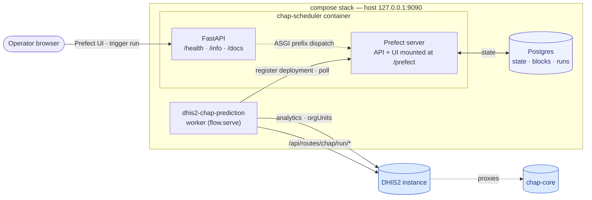

# Architecture

This page covers how the moving pieces fit together. Concept vocabulary
(flows, tasks, blocks, deployments, work pools) is in the
[Prefect primer](prefect.md).

## The compose stack

The default `compose.yml` runs three services. Operators interact with the
embedded Prefect UI; the worker container picks up flow runs and talks to
DHIS2 (and chap, via DHIS2's proxy routes) on the way out.



- **Postgres** — Prefect's state store (block instances, flow / task runs,
  deployments, schedules, artifacts).
- **chap-scheduler** — the FastAPI app. Hosts our small `/health` and
  `/info` endpoints **and** mounts the full Prefect server (API + UI) at
  `/prefect/*`. Same process, same port. No separate Prefect container.
- **dhis2-chap-prediction** — the worker container. Runs `flow.serve()`
  against the embedded Prefect API; both registers the deployment on
  startup and polls for new runs to execute.

Outbound traffic from the worker hits **DHIS2** (native analytics +
organisationUnits endpoints) and **chap** (via DHIS2's proxy routes
under `/api/routes/chap/run/*`).

## Load-bearing decisions

A few choices that shape the rest of the codebase:

### Prefect runs in-process

The full Prefect server (API + UI + scheduler / triggers /
task-run-recorder) is mounted inside the FastAPI app at `/prefect`. A small
ASGI dispatcher (`PrefectMountMiddleware`) handles the prefix:
`/prefect/api/*` is stripped before it reaches Prefect's API sub-app, while
`/prefect/*` UI traffic preserves the prefix so the SPA's asset URLs
resolve.

**Why:** one process, one port, one container image to operate. The
trade-off is that the Prefect UI is unauthenticated by default — see the
README's "Network exposure" note.

### Worker is a sibling container

Flow code lives in `src/chap_scheduler/flows/`; the worker container runs
`flow.serve()` and talks to the chap-scheduler API over HTTP. Block-type
registration happens from the worker, not the API.

**Why:** if the API container also talked to Prefect's client (e.g. to
register block types), the absence of `PREFECT_API_URL` at import time
would silently spawn a *second* in-process Prefect server in ephemeral
mode. Keeping all client-side Prefect work on the worker side avoids that
foot-gun.

!!! note "Concurrent workers"

    Running two worker containers against the same chap-scheduler API is
    fine — both call `Dhis2Credentials.register_type_and_schema()` on
    startup, and Prefect handles repeat registrations idempotently. The
    two workers will then both subscribe to the work pool and Prefect's
    queue locking ensures each flow run is picked up by exactly one of
    them.

### DHIS2 vs chap traffic is split

DHIS2 native endpoints (analytics, organisationUnits, system info) use
the upstream [`dhis2-client`](https://github.com/dhis2/dhis2-python-client)
library. The chap routes (`/api/routes/chap/run/*`) go through a thin
`ChapClient` we own, on top of plain `httpx`.

**Why:** chap returns structured error bodies (e.g. per-org-unit rejection
detail) that `dhis2-client` rolls up to `UNKNOWN`. We want those bodies
verbatim so the run-report can show the operator exactly what chap
rejected and why.

### Blocks supply credentials

A `Dhis2Credentials` Prefect block holds base URL, username, and a
`SecretStr` password. The worker auto-registers the block *type*;
operators create one block *instance* per DHIS2 server they want to talk
to and pick it from the dropdown when triggering a run.

**Why:** rotation is "edit the block, save"; the next flow run picks up
the new value. No env-var rewrites, no service restarts, no plain-text
passwords on disk.

### Per-run UI is minimal

Five parameters in the Prefect quick-run dialog: the credentials block,
an `end_mode` dropdown (`calculated` / `fixed` / `offset`), its two
mode-specific value fields (`end_date`, `end_period_offset`), and an
optional `prediction_setup_id` filter. Forecast horizon, dataset type,
and polling timeout are derived per prediction setup or set via
`pydantic-settings` (env-driven, not flow-parameter-driven).

**Why:** the operator's mental model should be "which DHIS2, optionally
which window, optionally which one setup" — everything else is policy
that lives in env / code, not in the UI dialog.

### End period auto-picks the freshest "all covariates have data" point

Production DHIS2 instances often have lagging climate covariates. Before
each prediction the flow probes the analytics API
(`LAST_12_MONTHS` / `LAST_52_WEEKS` / `LAST_5_YEARS` depending on the
model's period type), takes the **min** of the latest reported period
across all required covariates, and uses that as the cut-off. The
operator can override by picking `end_mode = "fixed"` (period covering
`end_date`) or `"offset"` (`end_period_offset` periods back from today).

**Why:** submitting a prediction with a missing covariate column is a hard
failure on chap's side. The probe lets us pick the latest period that's
guaranteed to have full input, and surface "DHIS2 isn't fresh enough yet"
clearly when nothing qualifies.

### Every run emits a markdown run-report artifact

Captures DHIS2 + chap-core versions, per-model outcomes (succeeded /
failed at which step), prediction ids, and grouped chap rejection
details. Always written, even when DHIS2 or chap was unreachable.

**Why:** the artifact is the operator's primary feedback channel. Logs
are good for "what happened mechanically", the artifact is good for "did
this run produce useful predictions, and if not, why not".

### Schedules are intentionally not baked in

The flow ships without a default `cron=...`. Operators add cron triggers
via the Prefect UI per deployment, which lets them run the same flow on
different cadences against different `Dhis2Credentials` blocks (e.g.
nightly against staging, weekly against production) without redeploying.

**Why:** the cadence is an operator-policy decision, not a property of
the code. Hard-coding it would force a code change every time the
operator wants to change the schedule, and there is no single right
answer across deployments.

## Repo layout

```text
chap-scheduler/
├── src/chap_scheduler/
│   ├── api/         # FastAPI app, routes, Prefect mount middleware
│   ├── blocks/      # Prefect block types (Dhis2Credentials)
│   ├── chap/        # ChapClient + pydantic models for chap requests/responses
│   ├── cli/         # Typer CLI entry point
│   ├── flows/       # Prefect flows + tasks (the `dhis2-chap-prediction` flow)
│   └── config.py    # pydantic-settings, CHAP_SCHEDULER_* env
├── tests/           # pytest, MockTransport-driven
├── compose.yml      # postgres + chap-scheduler + worker
├── Dockerfile       # shared by chap-scheduler and worker (different commands)
└── docs/            # this site
```
