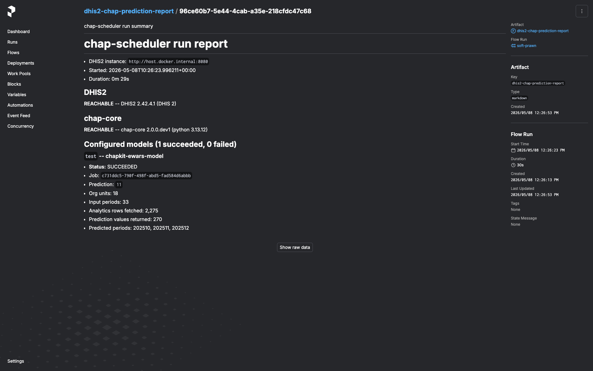

# chap-scheduler

A FastAPI service that drives [chap](https://github.com/dhis2-chap/chap-core)
disease-forecast predictions against a DHIS2 instance on a schedule, using
[Prefect](https://www.prefect.io/) for orchestration. Packaged for Docker.

!!! warning "Prototype only"

    This project is exploratory. APIs, behaviour, dependencies, data shapes,
    and operational conventions will change without notice. Don't rely on it
    for operational, clinical, or otherwise critical workloads. The embedded
    Prefect UI is unauthenticated; the default `compose.yml` binds to
    `127.0.0.1` only. See the README for the full safety note.

## What it does

For each *configured model with data source* registered in chap, the flow:

1. Probes DHIS2 for the freshest period where every required covariate has
   data, and uses that as the prediction's end period (operators can override
   via the `end_mode` dropdown: `fixed` + `end_date` or `offset` + `end_period_offset`).
2. Pulls the analytics rows + organisation-unit GeoJSON from DHIS2.
3. Builds a chap `run-prediction-setup` request and POSTs it to
   `/v1/crud/prediction-setups/{id}/run` over the DHIS2 → chap proxy
   routes (`/api/routes/chap/run/*`).
4. Polls the chap job until it terminates and stores the result.
5. Emits a markdown **run-report artifact** in the Prefect UI summarising
   per-model outcomes, failures, and any rejections.

## Where to start

- **[Prefect primer](prefect.md)** — five-minute orientation on flows,
  blocks, deployments, and work pools. The rest of the docs assume the
  vocabulary.
- **[Architecture](architecture.md)** — how the FastAPI app, embedded
  Prefect server, worker, DHIS2, chap, and Postgres fit together (with a
  diagram).
- **[Operations](operations.md)** — triggering a run, scheduling via the
  Prefect UI, reading the run-report, and common troubleshooting.
- **Quick-start, env, CLI** — see the
  [README on GitHub](https://github.com/dhis2-chap/chap-scheduler#quick-start).

## Project links

- **Source**: [dhis2-chap/chap-scheduler](https://github.com/dhis2-chap/chap-scheduler)
- **Tracking issue**: [CLIM-638](https://dhis2.atlassian.net/browse/CLIM-638)
- **Deferred work**: [ROADMAP.md](https://github.com/dhis2-chap/chap-scheduler/blob/main/ROADMAP.md)
