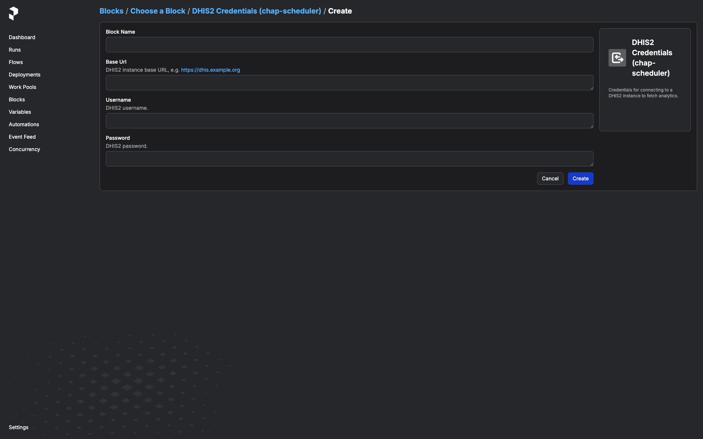
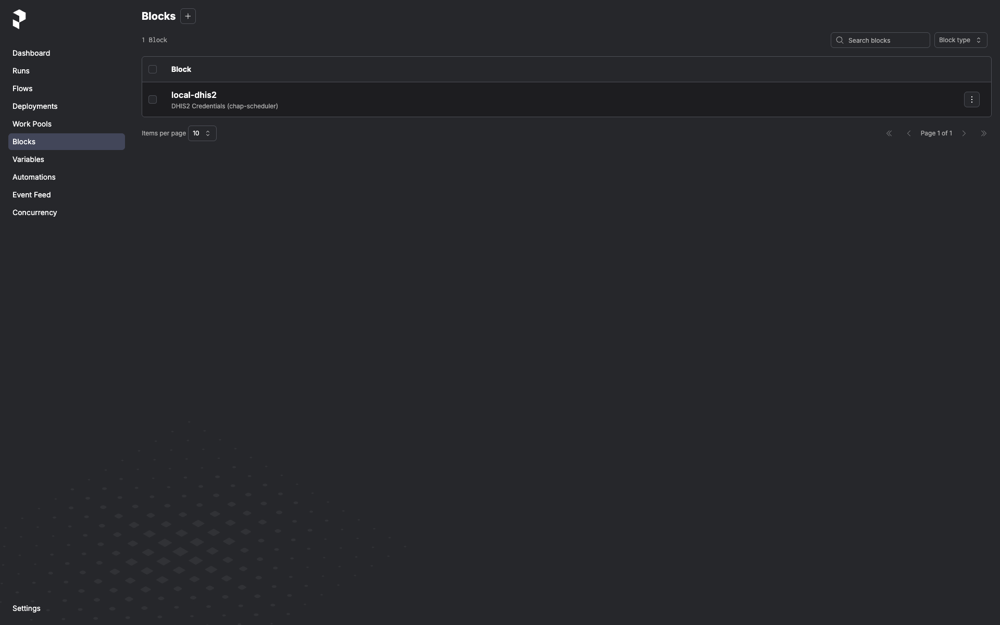
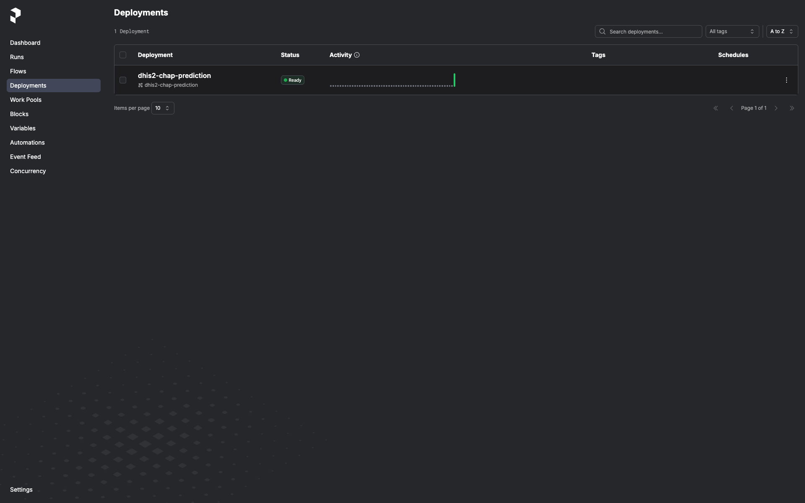
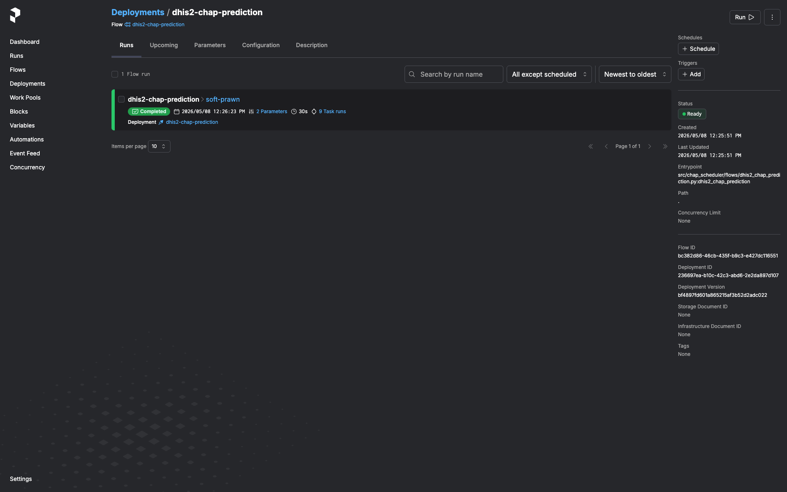
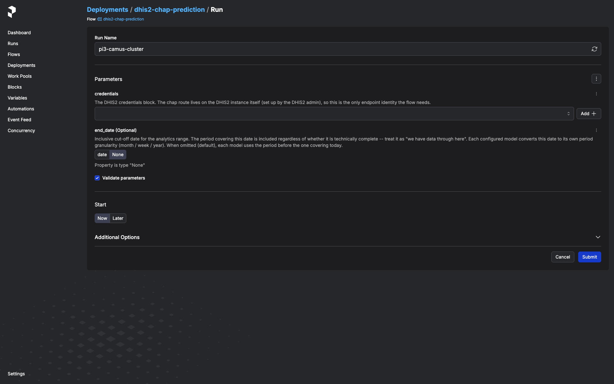
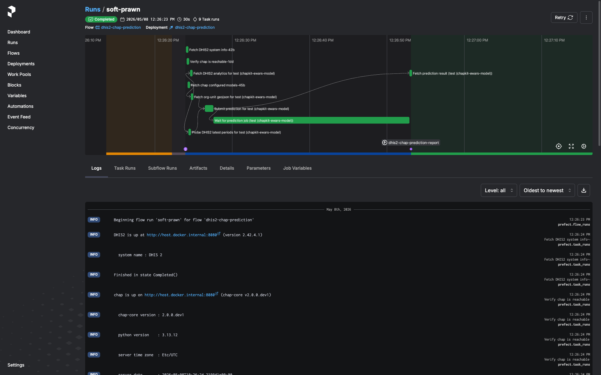
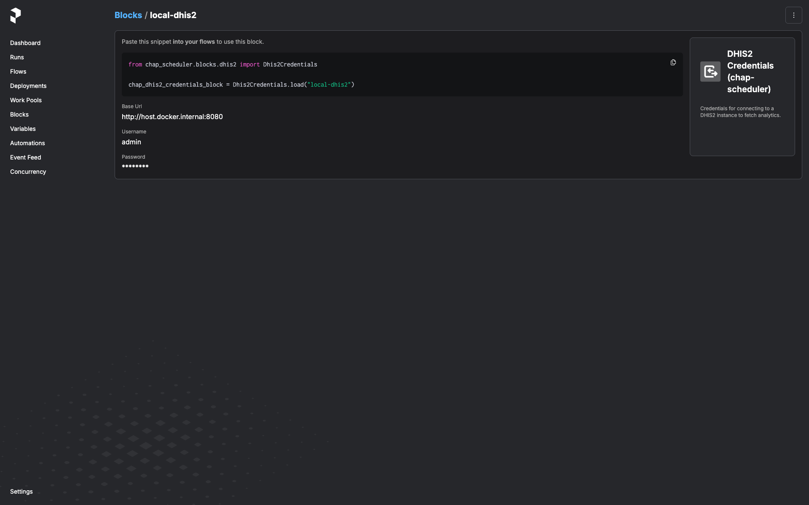

# Operations

Day-to-day tasks: triggering a run, scheduling, reading the run-report,
rotating credentials, and common troubleshooting. For installation and
quick-start, see the
[README](https://github.com/dhis2-chap/chap-scheduler#quick-start).

## Before triggering a run

The flow needs:

1. A DHIS2 instance reachable from the worker container, with the chap
   bundle installed and at least one **configured-model-with-data-source**
   row registered (chap UI → "Configured models").
2. A `Dhis2Credentials` block instance for that DHIS2 server. Create one
   in the Prefect UI:

    Open <http://127.0.0.1:9090/prefect/blocks/catalog> →
    *DHIS2 Credentials (chap-scheduler)* → **+ Add** → fill in
    `base_url`, `username`, `password` → save with a memorable name like
    `prod-dhis2`.

    

    Once saved, the block instance shows up in the Blocks list and is
    pickable from any flow that takes a `Dhis2Credentials` parameter:

    

## Trigger a one-off run

In the Prefect UI:

1. **Deployments** → **dhis2-chap-prediction**.

    

2. **Run** → **Custom run**.

    

3. Pick the `Dhis2Credentials` block from the dropdown.
4. (Optional) Pick the end-of-window mode in the `end` dropdown:
   - `calculated` (default) -- probe DHIS2 for the latest period with
     full covariate coverage. The original behaviour.
   - `fixed` + a `date` -- pin to the period covering that date.
     Treat the date as "we have data through here".
   - `offset` + an `offset` integer -- N periods back from today
     (`0` = current/in-progress, `1` = last complete, ...). Pure
     compute, no probe; useful for scheduled runs that want a stable
     look-back regardless of when DHIS2 last imported.
5. (Optional) Set `configured_model_id` to scope the run to a single
   configured-model-with-data-source row by its id; leave blank to
   process every row (default).
6. **Submit**.

    

The run lands in the run list. Click it to see logs and, once it
finishes, the **run-report artifact** (see next section).



## Schedules

The flow itself ships **without** a baked-in schedule (see
[Architecture](architecture.md#schedules-are-intentionally-not-baked-in)
for why). Add a cron trigger via the Prefect UI:

1. **Deployments** → **dhis2-chap-prediction** → **Schedules** tab →
   **+ Add Schedule**.
2. Pick **Cron** (or Interval if you prefer), set the cron expression and
   timezone.
3. Click **Edit parameters** on the schedule and pin the
   `Dhis2Credentials` block instance you want this schedule to use. You
   can add multiple schedules to the same deployment, each with its own
   block — e.g. nightly against staging, weekly against production.

The schedule will start firing immediately. Disable it from the same UI.

## Reading the run-report

Every run emits a markdown artifact named `dhis2-chap-prediction-report`.
Open the run in the Prefect UI → **Artifacts** tab. The report contains:

- **DHIS2 system info** (version, server time, instance URL) and **chap
  system info** (chap-core version, Python version, server timezone) —
  pinpoints what the run actually talked to.
- **Per-model section.** For each configured-model-with-data-source the
  flow tried:
    - Status (`succeeded` / `failed`).
    - On failure: which step (e.g. `fetch_dhis2_for_model`,
      `submit_prediction`, `wait_for_prediction`) and the error message.
    - For chap rejections (HTTP 400 with structured detail): the
      per-`(orgUnit, featureName)` "missing values" breakdown grouped by
      reason and time period.
    - On success: prediction id, analytics-row count, org-units covered,
      periods covered, predicted-period list.

The artifact is always written, including when DHIS2 or chap was
unreachable end-to-end (you'll see `dhis2_error` / `chap_error` set
instead of system info).


## Rotating DHIS2 credentials

In the Prefect UI: **Blocks** → click the block → **Edit** → update
`password` → save. The next flow run that uses this block picks up the
new value. No service restart, no env-var rewrite.



A flow run that's already in flight keeps the old password — block values
are loaded once at the start of the run and held in memory for the
duration. If you've rotated *because* the old password is compromised,
cancel any in-flight runs from the Prefect UI and let them re-trigger
against the new value.

## Deploying beyond loopback

The default `compose.yml` is sized for "run on the operator's laptop".
A few defaults flip from "fine" to "footgun" the moment the stack is
exposed to anything other than localhost — call them out explicitly
before binding to a public interface.

- **Prefect UI is unauthenticated.** It can read every saved
  `Dhis2Credentials` block (passwords are encrypted at rest, but the UI
  decrypts them to show the *Edit* form) and trigger flow runs against
  any of them. `compose.yml` binds to `127.0.0.1:9090` only. To expose
  the service, put a reverse proxy with auth (oauth2-proxy, Authelia,
  Cloudflare Access, …) in front and *do not* publish 9090 directly.
- **Postgres password is the literal `prefect`.** Hard-coded in
  `compose.yml` (both on the postgres container and in the
  chap-scheduler service's `PREFECT_API_DATABASE_CONNECTION_URL`). Fine
  on a loopback-bound stack since the postgres port isn't published —
  but if you copy this compose file to a shared host, change both
  occurrences to a real secret and feed them in via env vars or a
  secrets backend.
- **No request-size limits on the Prefect API.** Whatever Prefect ships
  by default. If you put a reverse proxy in front, set a sensible
  client-body limit there too.

## Scalability envelope

The flow holds the whole input batch in memory for the duration of a
run — there's no chunking, no streaming, no preflight cardinality
estimate. Per configured model, peak memory is roughly:

- **Analytics rows from DHIS2.** `(covariates × periods × org_units)`
  rows, each ~250 bytes serialized. A national-scale run with
  5 covariates × 60 months × 1,000 org units ≈ 300k rows ≈ 75 MB.
- **chap request body.** The JSON-encoded prediction request
  (observations + GeoJSON + metadata). Typically 2-3× the
  analytics-row memory because each observation becomes a small JSON
  object.
- **Org-unit GeoJSON.** Usually a few MB even for thousands of org
  units; not the bottleneck unless geometries are unusually dense.

The compose worker's `mem_limit` is **2 GiB**. Deliberately generous —
typical national-scale runs peak well under 200 MB — but bounded so
the worker fails loud rather than dragging the host into swap.

The flow also caps `_PERIOD_ENUMERATION_CAP` at 120 periods (~10 years
monthly / ~2 years weekly / 120 years yearly). A configured model that
would walk past the cap raises a `validate_period_range` failure
rather than silently submitting a truncated range.

If you hit OOMKills (or the run-report's "Analytics rows fetched" is
unexpectedly large):

1. **Check the configured model.** A typo in the org-unit list (a
   country root instead of a leaf set) can multiply the row count by
   two or three orders of magnitude.
2. **Pin the end period.** Trigger with `end.mode = "fixed"` (date)
   or `"offset"` (N periods back) instead of letting the freshness
   probe walk back from today; this bounds the period range to what
   you intended.
3. **Raise `mem_limit`.** Override the worker's `mem_limit` in your
   deployment's compose file. 2 GiB → 4 GiB is usually more than
   enough.
4. **Split the model.** If a single configured-model-with-data-source
   has a country-scale org-unit list and several years of monthly
   history, consider splitting it into per-region configured models on
   the chap side. Each runs as its own per-model entry in the same
   flow run.

A preflight cardinality estimate (probing DHIS2 for the row count
before the full fetch) is a roadmap item.

## Common troubleshooting

### "All regions rejected due to missing values" on every model

The prediction fired before DHIS2 had data for one or more required
covariates in the most recent period. Check the run-report's rejection
detail — the listed `featureName` and `timePeriods` tell you which
covariate is lagging.

If this is chronic for a covariate (typical for climate data lagging the
disease-cases pipeline), expect the freshness probe to step the end
period back a month or two automatically; the prediction will simply
target an earlier window than "today minus one period".

### `start period after end period`

The configured model's `startPeriod` is later than the end period the
flow resolved (via probe, fixed date, or offset). This is a
configuration issue on the chap side — the configured model needs a
`startPeriod` that's actually before any plausible end period.

### Prediction stays in `PENDING` / `RUNNING` past the timeout

The flow polls chap's job-status endpoint and gives up after
`CHAP_SCHEDULER_PREDICTION_TIMEOUT_SECONDS` (default in
[`config.py`](https://github.com/dhis2-chap/chap-scheduler/blob/main/src/chap_scheduler/config.py)).
Long-training models may need this raised. Set it in `.env` or as a
container env var.

### Worker registered but no deployment shows up in the UI

Check the worker container's logs. `flow.serve()` registers the
deployment only after the Prefect API is reachable; if the chap-scheduler
service is still starting, the worker retries in a loop. Once
`/prefect/api/health` returns 200 the deployment will appear.

### "Spawning a second Prefect server"

If you see Prefect logging "starting ephemeral server" from the API
container's logs, something in the API process is constructing a Prefect
client without `PREFECT_API_URL` set. This shouldn't happen in the
shipped code — block-type registration is intentionally on the worker
side for exactly this reason. File a bug if you hit it.

## CLI reference

```bash
chap-scheduler --version             # version
chap-scheduler info                  # resolved config (env-driven)
chap-scheduler serve                 # run the FastAPI server
chap-scheduler register-blocks       # register block types against a running API
                                     # (worker container does this automatically;
                                     #  use this command if you serve standalone)
```

All settings come from environment / `.env`, prefixed with
`CHAP_SCHEDULER_`. See
[`.env.example`](https://github.com/dhis2-chap/chap-scheduler/blob/main/.env.example).
